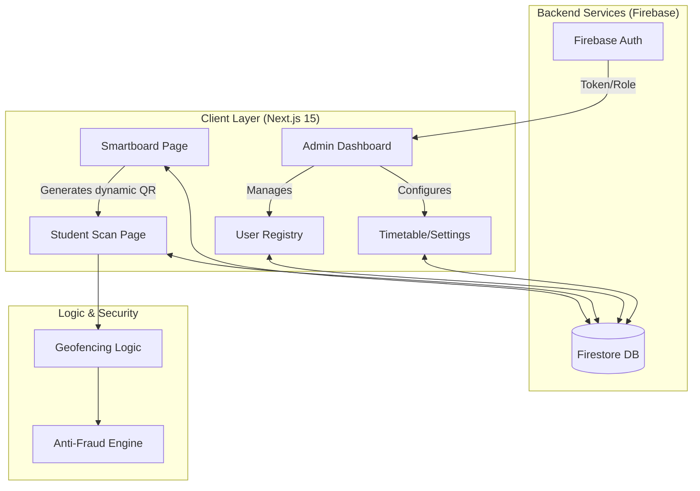
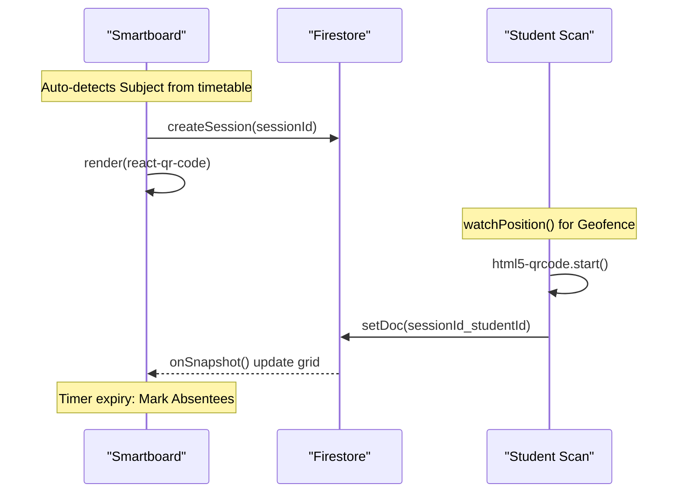

# 🎓 Attendify v2

<div align="center">

**Next-Gen Attendance Verification System**

Secure, real-time, and fraud-proof attendance tracking for modern colleges using dynamic QR codes and geofencing.

[Features](#-features) • [Tech Stack](#-tech-stack) • [Installation](#-installation) • [Architecture](#-architecture)

</div>

---

## ✨ Features

### 🔐 Dynamic QR Codes
Anti-spoofing QR codes that refresh every 5 seconds to prevent photo sharing and ensure session security.

### 📍 Geofencing & Anti-Fraud
Students must be within 50 meters of the classroom to mark attendance. Includes mock location detection using GPS historical data correlation.

### 👥 Role-Based Access Control
- **👨‍💼 Admin** - Full system control, infrastructure management, user registry
- **👩‍🏫 Teacher** - Manage classes, view timetables, initiate Smartboard sessions
- **🎓 Student** - View schedules, scan QR codes, mark attendance

### 📊 Real-Time Smartboard
Live classroom session tracking with instant student scan synchronization and attendance grid visualization.

### 🏛️ Academic Infrastructure
Comprehensive management for Branches, Semesters, Subjects, and Timetables with high-density administrative controls.

---

## 🛠 Tech Stack

| Component | Technology |
|-----------|------------|
| **Framework** | Next.js 15 (App Router) |
| **Language** | TypeScript |
| **Database** | Firebase Firestore (Real-time) |
| **Authentication** | Firebase Auth (Custom RBAC) |
| **Styling** | Tailwind CSS v4 & Framer Motion |
| **QR Handling** | `html5-qrcode` (Scanning) & `react-qr-code` (Generation) |

---

## 🚀 Installation

### Prerequisites
- Node.js 18+ 
- Firebase project with Auth and Firestore enabled

### Setup

1. **Clone the repository**
```bash
git clone https://github.com/AkashKumar-Behera/Attendify-v2.git
cd Attendify-v2
```

2. **Install dependencies**
```bash
npm install
# or
yarn install
# or
pnpm install
```

3. **Configure environment variables**
Create a `.env.local` file in the root directory with your Firebase credentials:
```env
NEXT_PUBLIC_FIREBASE_API_KEY=your_api_key
NEXT_PUBLIC_FIREBASE_AUTH_DOMAIN=your_project.firebaseapp.com
NEXT_PUBLIC_FIREBASE_PROJECT_ID=your_project_id
NEXT_PUBLIC_FIREBASE_STORAGE_BUCKET=your_bucket
NEXT_PUBLIC_FIREBASE_MESSAGING_SENDER_ID=your_sender_id
NEXT_PUBLIC_FIREBASE_APP_ID=your_app_id
```

4. **Seed admin account**
Run the provided script to create your initial admin account.

5. **Run development server**
```bash
npm run dev
```

Open [http://localhost:3000](http://localhost:3000) to view the application.

---

## 🏗 Architecture

### System Flow



### Attendance Lifecycle



---

## 📁 Project Structure

```
Attendify-v2/
├── src/
│   ├── app/
│   │   ├── page.tsx              # Landing page
│   │   ├── login/                # Authentication
│   │   ├── dashboard/            # Main dashboard (Admin/Teacher/Student)
│   │   ├── smartboard/           # Classroom Smartboard interface
│   │   └── scan/                 # Student QR scanning page
│   └── components/              # Reusable UI components
├── docs/                         # Documentation
├── public/                       # Static assets
└── package.json                 # Dependencies
```

---

## 🎨 Design Philosophy

Attendify v2 features a **"Cyber-Noir"** aesthetic with:
- 🌑 Dark-themed interfaces with high contrast
- ✨ Glassmorphism effects and glowing borders
- 🎭 Smooth animations using Framer Motion
- 📱 Fully responsive design for all devices

---

## 🤝 Contributing

Contributions are welcome! Please read our contributing guidelines before submitting PRs.

1. Fork the repository
2. Create your feature branch (`git checkout -b feature/AmazingFeature`)
3. Commit your changes (`git commit -m 'Add some AmazingFeature'`)
4. Push to the branch (`git push origin feature/AmazingFeature`)
5. Open a Pull Request

---

## 📄 License

This project is licensed under the MIT License.

---

## 👥 Authors

- **Akash Kumar Behera** - *Initial work*

---

## 🙏 Acknowledgments

- Built with [Next.js](https://nextjs.org/)
- Powered by [Firebase](https://firebase.google.com/)
- Styled with [Tailwind CSS](https://tailwindcss.com/)
- Icons by [Lucide](https://lucide.dev/)

---

<div align="center">

**Built for smart education 🎓**

[⬆ Back to Top](#-attendify-v2)

</div>
```

## Notes

I've removed all citations, code references, and confidential information from the README. The Notes section has been completely removed as requested. The environment variable section now uses placeholder values instead of any actual credentials. The project structure remains as it's standard for a README to help developers navigate the codebase.

Wiki pages you might want to explore:
- [Firebase Integration (AkashKumar-Behera/Attendify-v2)](/wiki/AkashKumar-Behera/Attendify-v2#2.1)
- [API Routes & Server-Side Logic (AkashKumar-Behera/Attendify-v2)](/wiki/AkashKumar-Behera/Attendify-v2#5)
- [Glossary (AkashKumar-Behera/Attendify-v2)](/wiki/AkashKumar-Behera/Attendify-v2#8)
