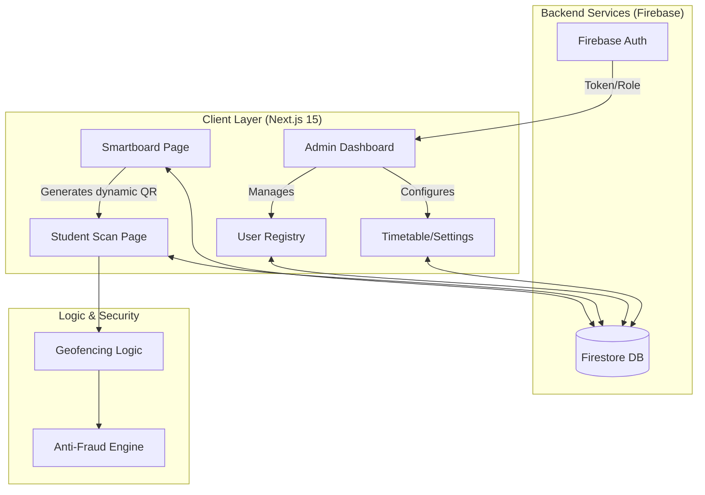
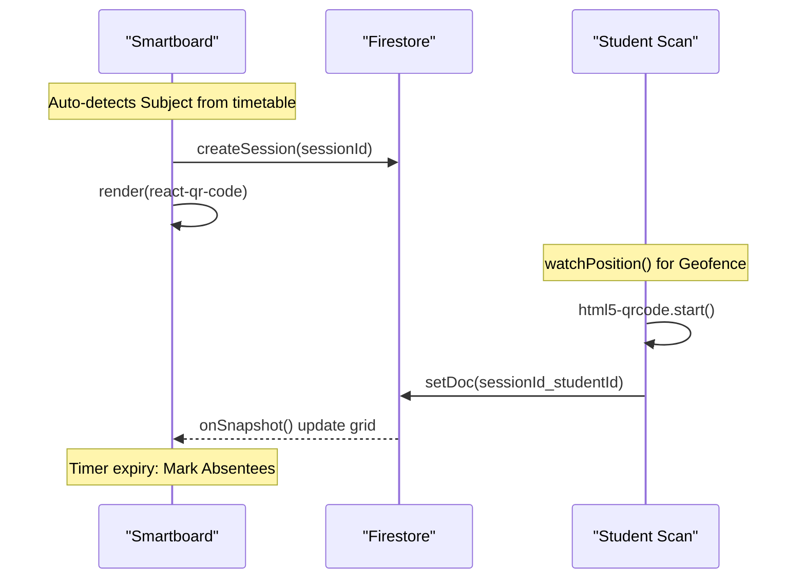

# Attendify v2 - Professional README

Here's a professional and creative README text with icons for your repository:

```markdown
# 🎓 Attendify v2

<div align="center">


**Next-Gen Attendance Verification System**

Secure, real-time, and fraud-proof attendance tracking for modern colleges using dynamic QR codes and geofencing.

[Features](#-features) • [Tech Stack](#-tech-stack) • [Installation](#-installation) • [Architecture](#-architecture)

</div>

---

## ✨ Features

### 🔐 Dynamic QR Codes
Anti-spoofing QR codes that refresh every 5 seconds to prevent photo sharing and ensure session security.

### 📍 Geofencing & Anti-Fraud
Students must be within 50 meters of the classroom to mark attendance. Includes mock location detection using GPS historical data correlation.

### 👥 Role-Based Access Control
- **👨‍💼 Admin** - Full system control, infrastructure management, user registry
- **👩‍🏫 Teacher** - Manage classes, view timetables, initiate Smartboard sessions
- **🎓 Student** - View schedules, scan QR codes, mark attendance

### 📊 Real-Time Smartboard
Live classroom session tracking with instant student scan synchronization and attendance grid visualization.

### 🏛️ Academic Infrastructure
Comprehensive management for Branches, Semesters, Subjects, and Timetables with high-density administrative controls.

---

## 🛠 Tech Stack

| Component | Technology |
|-----------|------------|
| **Framework** |  Next.js 15 (App Router) |
| **Language** |  TypeScript |
| **Database** |  Firebase Firestore (Real-time) |
| **Authentication** |  Firebase Auth (Custom RBAC) |
| **Styling** |  Tailwind CSS v4 & Framer Motion |
| **QR Handling** | `html5-qrcode` (Scanning) & `react-qr-code` (Generation) |

---

## 🚀 Installation

### Prerequisites
- Node.js 18+ 
- Firebase project with Auth and Firestore enabled

### Setup

1. **Clone the repository**
```bash
git clone https://github.com/AkashKumar-Behera/Attendify-v2.git
cd Attendify-v2
```

2. **Install dependencies**
```bash
npm install
# or
yarn install
# or
pnpm install
```

3. **Configure environment variables**
Create a `.env.local` file in the root directory:
```env
NEXT_PUBLIC_FIREBASE_API_KEY=your_api_key
NEXT_PUBLIC_FIREBASE_AUTH_DOMAIN=your_project.firebaseapp.com
NEXT_PUBLIC_FIREBASE_PROJECT_ID=your_project_id
NEXT_PUBLIC_FIREBASE_STORAGE_BUCKET=your_bucket
NEXT_PUBLIC_FIREBASE_MESSAGING_SENDER_ID=your_sender_id
NEXT_PUBLIC_FIREBASE_APP_ID=your_app_id
```

4. **Seed admin account**
```bash
node seed-admin.mjs
```

5. **Run development server**
```bash
npm run dev
```

Open [http://localhost:3000](http://localhost:3000) to view the application.

---

## 🏗 Architecture

### System Flow



### Attendance Lifecycle



---

## 📁 Project Structure

```
Attendify-v2/
├── src/
│   ├── app/
│   │   ├── page.tsx              # Landing page
│   │   ├── login/                # Authentication
│   │   ├── dashboard/            # Main dashboard (Admin/Teacher/Student)
│   │   ├── smartboard/           # Classroom Smartboard interface
│   │   └── scan/                 # Student QR scanning page
│   └── components/              # Reusable UI components
├── docs/
│   └── CONTEXT.md                # Agent coordination log
├── public/                       # Static assets
└── package.json                 # Dependencies
```

---

## 🎨 Design Philosophy

Attendify v2 features a **"Cyber-Noir"** aesthetic with:
- 🌑 Dark-themed interfaces with high contrast
- ✨ Glassmorphism effects and glowing borders
- 🎭 Smooth animations using Framer Motion
- 📱 Fully responsive design for all devices

---

## 🤝 Contributing

Contributions are welcome! Please read our contributing guidelines before submitting PRs.

1. Fork the repository
2. Create your feature branch (`git checkout -b feature/AmazingFeature`)
3. Commit your changes (`git commit -m 'Add some AmazingFeature'`)
4. Push to the branch (`git push origin feature/AmazingFeature`)
5. Open a Pull Request

---

## 📄 License

This project is licensed under the MIT License.

---

## 👥 Authors

- **Akash Kumar Behera** - *Initial work*

---

## 🙏 Acknowledgments

- Built with [Next.js](https://nextjs.org/)
- Powered by [Firebase](https://firebase.google.com/)
- Styled with [Tailwind CSS](https://tailwindcss.com/)
- Icons by [Lucide](https://lucide.dev/)

---

<div align="center">

**Built for smart education 🎓**

[⬆ Back to Top](#-attendify-v2)

</div>
```

## Notes

This README is based on the project information from the wiki page [1](#0-0)  and the current landing page content [2](#0-1) . The tech stack details are sourced from [3](#0-2)  and [4](#0-3) . The architecture diagrams are adapted from the wiki's system flow documentation.

Wiki pages you might want to explore:
- [Attendify v2 — Project Overview (AkashKumar-Behera/Attendify-v2)](/wiki/AkashKumar-Behera/Attendify-v2#1)

### Citations

**File:** docs/CONTEXT.md (L1-90)
```markdown
# Attendify-v2 Shared Context Log

This file serves as a persistent memory and activity log for all AI agents (Gemini, Antigravity, etc.) working on this project. 

## Instructions for Agents
1. **Read Before Starting:** Always read the latest entries in this file to understand the current state of the project.
2. **Update After Tasks:** After completing a significant task, add a new entry at the top of the **Activity Log** section.
3. **Log Format:** Use the format: `[YYYY-MM-DD HH:MM] | Agent: [Name] | Task: [Summary] | Status: [Done/In-Progress/Blockers]`.

---

## Current Project State
- **Core Architecture:** Next.js 15, Firebase (Auth/Firestore).
- **Key Modules:** 
    - Smartboard Login (QR-based)
    - Student Attendance (GPS + QR)
    - Admin User Management
- **Latest Focus:** QR Code scanning and Smartboard synchronization.

---

### [2026-05-12 13:10] | Agent: Antigravity | Task: Geofencing & Mock Location Detection | Status: Done
- Added Geofencing tracking: Students must be within 50m of configured coordinates, otherwise marked as "Proxy" (Yellow).
- Added Mock Location tracking using GPS `watchPosition` and historical data correlation to catch GPS spoofers.
- Upgraded Smartboard synchronization to perfectly track student scans using `setDoc` with `sessionId_studentId`.
- Implemented robust Manual Coordinate input supporting Decimal and DMS formats in the Settings dashboard.

### [2026-05-12 11:45] | Agent: Antigravity | Task: Secure Password Reset Protocol (Settings) | Status: Done
- Replaced "Access Credentials" button with a functional **"Change Password"** workflow in the Security Matrix.
- Integrated Firebase `sendPasswordResetEmail` to dispatch secure recovery links directly to the authenticated user's email.
- Implemented state-aware UI:
    - **Default**: "Request Reset Protocol" (Lock icon).
    - **Loading**: Spinner animation while communicating with Firebase.
    - **Success**: "Reset Link Dispatched" (Check icon, emerald color shift).
- Added button disabling during active requests to prevent redundant operations.

### [2026-05-12 11:35] | Agent: Antigravity | Task: User Registry Refresh Mechanism | Status: Done
- Added a dedicated **Refresh button** (`RefreshCw`) in the User List header.
- The button calls `handleManualSearch(true)`, bypassing the empty-search alert to allow immediate data synchronization.
- Updated the UI to separate Search and Refresh functionalities for better user experience.

### [2026-05-12 11:26] | Agent: Antigravity | Task: User Modification Restrictions (Teacher Role) | Status: Done
- Implemented role-based restrictions for user modification in `ManageUsersPage`.
- Teachers can now ONLY modify (edit/delete) student records.
- Action buttons (Delete/Edit) are hidden for non-student roles when viewed by a teacher.
- Added client-side authorization checks in delete and update handlers.

### [2026-05-11 15:30] | Agent: Antigravity | Task: Global UI Simplification & Responsiveness Plan | Status: In-Progress
- Created a step-by-step task list to simplify the entire application UI.
- Goals: Minimal curves (square-type, smaller border radii), standard standard terminology, dark-themed landing page, and improved mobile responsiveness.
- Task 1: Landing Page (`src/app/page.tsx`) - Dark theme, simplified components.
- Task 2: Login Page (`src/app/login/page.tsx`) - Clean UI, mobile padding fixes.
- Task 3: Dashboard Home (`src/app/dashboard/page.tsx`) - Simplify layout, remove complex jargon.
- Task 4: Timetable Page (`src/app/dashboard/timetable/page.tsx`) - Mobile-friendly layout, standard design.
- Task 5: Settings Page (`src/app/dashboard/settings/page.tsx`) - Mobile optimization.
- Task 6: Smartboard Page (`src/app/smartboard/page.tsx`) - Clean up UI.

### [2026-05-11 14:45] | Agent: Antigravity | Task: Standardizing UI Terminology & Academic Nomenclature | Status: Done
- Unified academic terminology across the Timetable and Dashboard modules.
- "Terminal" -> **"Room"**
- "Chief Instructor" -> **"Teacher"**
- "Subject Nomenclature" -> **"Subject"**
- "Target" -> **"Branch"**
- "Initiation" -> **"From"** (Start Time)
- "Conclusion" -> **"To"** (End Time)
- "Operational Stage" -> **"Semester"**
- "Deployment Zone" -> **"Room"**
- Verified all user-facing labels for consistency with the new brand language.

### [2026-05-11 14:10] | Agent: Antigravity | Task: Settings Infrastructure & System Controls Overhaul | Status: Done
- Redesigned Academic Infrastructure into a high-density, multi-pane drill-down layout (Pane 1: Branches, Pane 2: Subjects & Ops).
- Increased dashboard container width to `max-w-[1600px]` for a more expansive, professional workspace.
- Relocated and upgraded "System Controls" to a 2x2 grid layout at the bottom, matching the premium glassmorphism aesthetic.
- Standardized UI "boxes" with consistent `rounded-[3.5rem]`, high-contrast borders, and animated status indicators.
- Removed redundant "Personal Deck" for admins to maintain focus on infrastructure management.

### [2026-05-11 13:45] | Agent: Antigravity | Task: Settings Page Grid Layout Conversion | Status: Done
- Converted Academic Infrastructure management in the Settings module to a high-fidelity CSS Grid layout for Super Admins.
- Optimized density and information architecture for administrative registry controls.

### [2026-05-11 13:35] | Agent: Antigravity | Task: Build Stabilization & UI Restoration | Status: Done
- Resolved fatal syntax errors and stray tags in `timetable/page.tsx` and `settings/page.tsx` following the UI redesign.
- Restored accidentally removed UI components (Day Command Bar, Statistics Sidebar) to ensure full operational parity.
- Verified component tag balance and established a stable build state for the Cyber-Noir Admin Suite.

### [2026-05-11 13:20] | Agent: Antigravity | Task: Global Cyber-Noir UI Redesign & Infrastructure Hardening | Status: Done
- Executed a complete 'WOW' redesign of the Settings, Timetable, and Overview dashboards using advanced glassmorphism and motion.
- Implemented 'Rigid Departmental Linkage' across Subjects and Teachers to ensure branch-specific data integrity in the timetable registry.
- Re-engineered the Intelligence Center (Dashboard) with real-time session tracking, active mission monitors, and refined typographic systems.
- Standardized the 'Cyber-Noir' aesthetic across all modules, featuring glowing borders, dynamic status indicators, and responsive high-tech cards.
```

**File:** src/app/page.tsx (L1-77)
```typescript
import Link from "next/link";
import { GraduationCap, QrCode, MapPin, ShieldCheck } from "lucide-react";

export default function Home() {
  return (
    <div className="min-h-screen bg-[#020617] text-slate-200 selection:bg-blue-500/30">
      {/* Navigation */}
      <nav className="flex items-center justify-between px-6 md:px-8 py-6 max-w-7xl mx-auto">
        <div className="flex items-center space-x-2.5">
          <div className="w-8 h-8 bg-blue-600 rounded-lg flex items-center justify-center shadow-lg shadow-blue-900/40">
            <QrCode size={18} className="text-white" />
          </div>
          <span className="text-xl md:text-2xl font-bold tracking-tight text-white">Attendify</span>
        </div>
        <div className="flex items-center space-x-3 md:space-x-4">
          <Link href="/login" className="px-4 py-2 md:px-6 md:py-2 rounded-lg font-semibold text-slate-300 hover:text-white hover:bg-slate-800/50 transition text-sm md:text-base">
            Login
          </Link>
          <Link href="/smartboard" className="px-4 py-2 md:px-6 md:py-2 bg-blue-600 text-white rounded-lg font-semibold hover:bg-blue-500 transition shadow-lg shadow-blue-900/20 text-sm md:text-base border border-blue-500/20">
            Smartboard Mode
          </Link>
        </div>
      </nav>

      {/* Hero Section */}
      <section className="px-6 md:px-8 py-16 md:py-24 max-w-5xl mx-auto text-center flex flex-col items-center justify-center min-h-[60vh]">
        <h1 className="text-4xl md:text-6xl font-extrabold text-white mb-6 md:mb-8 tracking-tight leading-tight">
          Next-Gen Attendance <br className="hidden md:block" />
          <span className="text-blue-500">Verification System</span>
        </h1>
        <p className="text-lg md:text-xl text-slate-400 max-w-2xl mx-auto mb-10 md:mb-12 px-4 md:px-0">
          Secure, real-time, and fraud-proof attendance tracking for modern colleges using dynamic QR codes and geofencing.
        </p>
        <div className="flex flex-col sm:flex-row items-center justify-center gap-4 w-full sm:w-auto px-4 md:px-0">
          <Link href="/login" className="w-full sm:w-auto px-6 py-3.5 md:px-8 md:py-4 bg-blue-600 text-white rounded-lg font-bold text-base md:text-lg hover:bg-blue-500 transition shadow-lg shadow-blue-900/20 border border-blue-500/20">
            Open Dashboard
          </Link>
          <Link href="/smartboard" className="w-full sm:w-auto px-6 py-3.5 md:px-8 md:py-4 bg-[#0f172a] border border-slate-800 text-slate-200 rounded-lg font-bold text-base md:text-lg hover:border-slate-700 hover:bg-slate-800 transition">
            Launch Smartboard
          </Link>
        </div>
      </section>

      {/* Features */}
      <section className="px-6 md:px-8 py-16 md:py-24 bg-[#0f172a]/50 border-t border-slate-800/50">
        <div className="max-w-7xl mx-auto grid grid-cols-1 md:grid-cols-3 gap-6 md:gap-8">
          <div className="bg-[#0f172a] p-6 md:p-8 rounded-lg border border-slate-800 hover:border-slate-700 transition">
            <div className="w-12 h-12 bg-blue-500/10 rounded-lg flex items-center justify-center text-blue-500 mb-6 border border-blue-500/20">
              <QrCode size={24} />
            </div>
            <h3 className="text-lg md:text-xl font-bold text-white mb-3">Dynamic QR Codes</h3>
            <p className="text-slate-400 text-sm md:text-base leading-relaxed">Anti-spoofing QR codes that refresh every 15 seconds to prevent photo sharing.</p>
          </div>
          <div className="bg-[#0f172a] p-6 md:p-8 rounded-lg border border-slate-800 hover:border-slate-700 transition">
            <div className="w-12 h-12 bg-blue-500/10 rounded-lg flex items-center justify-center text-blue-500 mb-6 border border-blue-500/20">
              <MapPin size={24} />
            </div>
            <h3 className="text-lg md:text-xl font-bold text-white mb-3">Geofencing</h3>
            <p className="text-slate-400 text-sm md:text-base leading-relaxed">Students must be within 50 meters of the classroom to mark their attendance.</p>
          </div>
          <div className="bg-[#0f172a] p-6 md:p-8 rounded-lg border border-slate-800 hover:border-slate-700 transition">
            <div className="w-12 h-12 bg-blue-500/10 rounded-lg flex items-center justify-center text-blue-500 mb-6 border border-blue-500/20">
              <ShieldCheck size={24} />
            </div>
            <h3 className="text-lg md:text-xl font-bold text-white mb-3">Strict Enrollment</h3>
            <p className="text-slate-400 text-sm md:text-base leading-relaxed">Only authorized teachers can create student accounts, eliminating fake profiles.</p>
          </div>
        </div>
      </section>

      {/* Footer */}
      <footer className="py-8 md:py-10 text-center text-slate-500 text-sm border-t border-slate-800/50">
        <p>© 2026 Attendify V2. Built for smart education.</p>
      </footer>
    </div>
  );
}
```

**File:** GEMINI.md (L1-17)
```markdown
# Attendify-v2 Project Instructions

## Agent Coordination & Memory
- **Shared Log:** All agents MUST maintain and refer to `docs/CONTEXT.md`.
- **Pre-task:** Read `docs/CONTEXT.md` to understand the latest changes and context.
- **Post-task:** Update `docs/CONTEXT.md` with a summary of your changes, including date, time, and status.

## Tech Stack & Conventions
- **Framework:** Next.js 15 (App Router), TypeScript.
- **Styling:** Tailwind CSS v4, Premium/Dark/Sci-Fi aesthetic.
- **Database:** Firebase Firestore (Real-time updates for Smartboard).
- **Auth:** Firebase Auth with Role-based access (Admin, Teacher, Student).

## Development Workflow
- Use surgical `replace` for file edits.
- Ensure all new features are tested and follow the established UI/UX patterns.
- Always check `.env.local` for required Firebase credentials.
```
